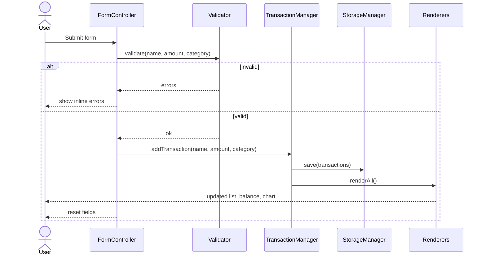
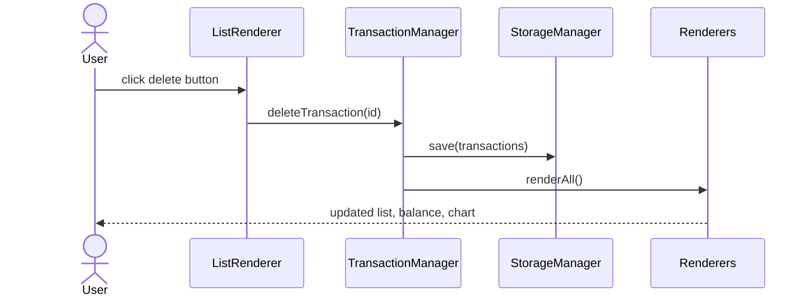

# Design Document: Expense & Budget Visualizer

## Overview

The Expense & Budget Visualizer is a single-page, client-side web application for tracking personal expenses. Users enter transactions (name, amount, category), view a running total balance, browse a scrollable transaction history, and see a live pie chart of spending by category. All data is persisted in the browser's Local Storage — no server, no build tools, no frameworks.

The application is delivered as three files:
- `index.html` — page structure and Chart.js CDN script tag
- `css/styles.css` — all visual styling
- `js/app.js` — all application logic

The design prioritises simplicity and directness: a single JavaScript module manages state, storage, rendering, and event handling. There are no external runtime dependencies beyond Chart.js (loaded via CDN).

---

## Architecture

The application follows a **unidirectional data flow** pattern within a single JS file:

```
User Action
    │
    ▼
Event Handler (in app.js)
    │
    ▼
State Mutation  ──►  Storage.save()
    │
    ▼
Render (Transaction_List, Balance_Display, Chart)
```

All mutable state lives in a single in-memory array (`transactions`). Every user action that changes state (add, delete) immediately persists the full array to Local Storage and then re-renders all three UI components. This keeps the UI always consistent with storage.

### Module Responsibilities

| Module / Section | Responsibility |
|---|---|
| `StorageManager` | Read/write the `transactions` array to/from `localStorage` |
| `Validator` | Validate Input_Form field values before a transaction is created |
| `TransactionManager` | Add and delete transactions; coordinate storage + render |
| `BalanceRenderer` | Compute and display the sum of all transaction amounts |
| `ListRenderer` | Render the scrollable transaction list and empty state |
| `ChartRenderer` | Build/update the Chart.js pie chart |
| `FormController` | Handle form submit event, call Validator, reset form |

These are logical sections within `app.js`, not separate files. They are implemented as plain objects or groups of functions.

### Sequence: Add Transaction



### Sequence: Delete Transaction



---

## Components and Interfaces

### StorageManager

```js
StorageManager = {
  STORAGE_KEY: 'expense_transactions',

  // Returns array of Transaction objects, or [] on error.
  // Displays a non-blocking warning if storage is unavailable or parse fails.
  load(): Transaction[],

  // Serialises transactions array to JSON and writes to localStorage.
  save(transactions: Transaction[]): void,
}
```

### Validator

```js
Validator = {
  // Returns { valid: boolean, errors: { name?: string, amount?: string, category?: string } }
  validate(name: string, amount: string, category: string): ValidationResult,
}
```

Rules:
- `name`: must be a non-empty string after trimming whitespace
- `amount`: must parse as a finite number greater than 0
- `category`: must be one of `'Food'`, `'Transport'`, `'Fun'`

### TransactionManager

```js
TransactionManager = {
  transactions: Transaction[],   // in-memory state

  // Initialise from storage; call renderAll().
  init(): void,

  // Create a new Transaction, save, renderAll().
  add(name: string, amount: number, category: Category): void,

  // Remove transaction by id, save, renderAll().
  delete(id: string): void,
}
```

### BalanceRenderer

```js
BalanceRenderer = {
  // Sums all transaction amounts and updates the Balance_Display element.
  render(transactions: Transaction[]): void,
}
```

### ListRenderer

```js
ListRenderer = {
  // Clears and re-renders the transaction list.
  // Shows empty-state message when transactions is empty.
  render(transactions: Transaction[]): void,
}
```

### ChartRenderer

```js
ChartRenderer = {
  chartInstance: Chart | null,

  // Creates or updates the Chart.js pie chart.
  // Shows placeholder when transactions is empty.
  render(transactions: Transaction[]): void,
}
```

### FormController

```js
FormController = {
  // Attaches submit event listener to the Input_Form.
  init(): void,

  // Reads field values, calls Validator, shows errors or calls TransactionManager.add().
  handleSubmit(event: SubmitEvent): void,

  // Clears all form fields and hides error messages.
  reset(): void,
}
```

---

## Data Models

### Transaction

```js
{
  id: string,          // UUID v4 generated at creation time (crypto.randomUUID())
  name: string,        // item name, trimmed, non-empty
  amount: number,      // positive finite number, stored as float
  category: Category,  // 'Food' | 'Transport' | 'Fun'
  createdAt: string,   // ISO 8601 timestamp (new Date().toISOString())
}
```

### Category (enum-like constant)

```js
const CATEGORIES = ['Food', 'Transport', 'Fun'];
```

### ValidationResult

```js
{
  valid: boolean,
  errors: {
    name?: string,      // error message if name is invalid
    amount?: string,    // error message if amount is invalid
    category?: string,  // error message if category is invalid
  }
}
```

### Storage Schema

Transactions are stored under the key `'expense_transactions'` as a JSON-serialised array of `Transaction` objects:

```json
[
  {
    "id": "550e8400-e29b-41d4-a716-446655440000",
    "name": "Coffee",
    "amount": 3.50,
    "category": "Food",
    "createdAt": "2024-01-15T09:30:00.000Z"
  }
]
```

### Category Color Map

```js
const CATEGORY_COLORS = {
  Food:      '#FF6384',
  Transport: '#36A2EB',
  Fun:       '#FFCE56',
};
```

These colors are used consistently in the Chart legend and pie slices.

---

## Correctness Properties

*A property is a characteristic or behavior that should hold true across all valid executions of a system — essentially, a formal statement about what the system should do. Properties serve as the bridge between human-readable specifications and machine-verifiable correctness guarantees.*

### Property 1: Validator rejects blank or whitespace-only names

*For any* string composed entirely of whitespace characters (including the empty string), the Validator SHALL return `valid: false` with a non-empty error message for the `name` field.

**Validates: Requirements 1.4, 1.5**

---

### Property 2: Validator rejects non-positive amounts

*For any* numeric string that represents a value ≤ 0, or any non-numeric string, the Validator SHALL return `valid: false` with a non-empty error message for the `amount` field.

**Validates: Requirements 1.4, 1.5**

---

### Property 3: Adding a transaction grows the list by exactly one

*For any* transaction list of arbitrary length and any valid transaction (non-empty name, positive amount, valid category), adding that transaction SHALL result in the list length increasing by exactly one.

**Validates: Requirements 1.3, 2.3**

---

### Property 4: Deleting a transaction removes exactly that entry

*For any* transaction list containing at least one transaction, deleting a transaction by its `id` SHALL result in a list that no longer contains an entry with that `id` and whose length is exactly one less than before.

**Validates: Requirements 2.5**

---

### Property 5: Balance equals sum of all transaction amounts

*For any* collection of transactions, the value displayed by Balance_Display SHALL equal the arithmetic sum of all `amount` fields in that collection, formatted to two decimal places.

**Validates: Requirements 3.1, 3.4, 3.5**

---

### Property 6: Storage round-trip preserves transaction data

*For any* array of Transaction objects, serialising to Local Storage and then deserialising SHALL produce an array that is deeply equal to the original (same `id`, `name`, `amount`, `category`, `createdAt` for every entry).

**Validates: Requirements 5.1, 5.2, 5.3**

---

### Property 7: Chart category totals match transaction data

*For any* collection of transactions, the spending total for each category shown in the Chart SHALL equal the sum of `amount` fields for all transactions in that category.

**Validates: Requirements 4.1, 4.2**

---

### Property 8: Balance update is consistent with add/delete operations

*For any* sequence of add and delete operations on an initially empty transaction list, the Balance_Display value after each operation SHALL equal the sum of the amounts of all currently stored transactions.

**Validates: Requirements 3.2, 3.3**

---

## Error Handling

### Storage Unavailable or Corrupt

- On `init()`, `StorageManager.load()` wraps `localStorage.getItem` and `JSON.parse` in a `try/catch`.
- If either throws (e.g., `SecurityError`, `SyntaxError`), the app initialises with an empty `[]` array.
- A non-blocking warning banner is shown to the user (e.g., "Could not load saved data. Starting fresh.").
- The banner is dismissible and does not block interaction.

### Validation Errors

- Inline error messages appear adjacent to each invalid field immediately on submit.
- Error messages are cleared when the user next modifies the corresponding field or on a successful submit.
- No transaction is created when validation fails.

### Chart.js CDN Failure

- If Chart.js fails to load (network error), the chart canvas area displays a static fallback message: "Chart unavailable — could not load Chart.js."
- This is detected via the `<script>` tag's `onerror` handler.
- All other app functionality (form, list, balance) continues to work normally.

### Invalid Transaction ID on Delete

- If `deleteTransaction(id)` is called with an `id` not present in the array (e.g., double-click race), the operation is a no-op and no error is thrown.

---

## Testing Strategy

### Overview

The application uses a **dual testing approach**:
- **Unit / example-based tests** for specific behaviours, edge cases, and error conditions
- **Property-based tests** for universal correctness properties across a wide input space

Property-based testing is appropriate here because the core logic (Validator, TransactionManager, BalanceRenderer, StorageManager, ChartRenderer aggregation) consists of pure or near-pure functions whose correctness must hold across all valid inputs, not just a handful of examples.

### Property-Based Testing

**Library**: [fast-check](https://github.com/dubzzz/fast-check) (JavaScript/TypeScript PBT library)

**Configuration**: Each property test runs a minimum of **100 iterations**.

**Tag format**: Each property test is tagged with a comment:
```
// Feature: expense-budget-visualizer, Property N: <property_text>
```

**Properties to implement**:

| Property | Test Description | fast-check Arbitraries |
|---|---|---|
| P1: Validator rejects blank/whitespace names | `fc.stringOf(fc.constantFrom(' ', '\t', '\n'))` → `validate(s, '10', 'Food').valid === false` | `fc.string` filtered to whitespace-only |
| P2: Validator rejects non-positive amounts | `fc.oneof(fc.double({max: 0}), fc.string())` → `validate('Coffee', s, 'Food').valid === false` | `fc.double`, `fc.string` |
| P3: Add grows list by one | `fc.array(transactionArb)` + `validTransactionArb` → `add()` increases length by 1 | custom `transactionArb` |
| P4: Delete removes exactly one entry | `fc.array(transactionArb, {minLength: 1})` → `delete(id)` removes entry with that id | custom `transactionArb` |
| P5: Balance equals sum | `fc.array(transactionArb)` → `computeBalance(txns) === txns.reduce((s,t) => s+t.amount, 0)` | custom `transactionArb` |
| P6: Storage round-trip | `fc.array(transactionArb)` → `load(save(txns))` deeply equals `txns` | custom `transactionArb` |
| P7: Chart totals match | `fc.array(transactionArb)` → per-category sum in chart data equals filtered sum | custom `transactionArb` |
| P8: Balance consistent with operations | `fc.array(operationArb)` → balance after each op equals sum of current transactions | custom `operationArb` |

### Unit / Example-Based Tests

- **Validator**: test each field in isolation with concrete valid and invalid values
- **StorageManager**: test with a mock `localStorage` (in-memory stub)
- **ListRenderer**: test empty-state message appears when `transactions = []`
- **ChartRenderer**: test placeholder shown when `transactions = []`; test correct category colors
- **FormController**: test form reset after successful submission; test error display on invalid submit
- **BalanceRenderer**: test zero display when no transactions; test currency formatting (two decimal places)

### Integration Tests

- Load app with pre-populated Local Storage → verify list, balance, and chart all render correctly
- Add a transaction end-to-end → verify list, balance, and chart all update
- Delete a transaction end-to-end → verify list, balance, and chart all update
- Corrupt Local Storage value → verify warning banner appears and app starts with empty state

### Accessibility Tests

- Verify color contrast ratios meet WCAG 2.1 AA (4.5:1 for normal text) using automated tooling (e.g., axe-core)
- Verify all form fields have associated `<label>` elements
- Verify delete buttons have accessible names (e.g., `aria-label="Delete Coffee"`)

### Performance Tests

- Render 500 transactions and measure time for add/delete operations (target: < 100ms)
- Measure initial load time on a simulated broadband connection (target: < 3s)
